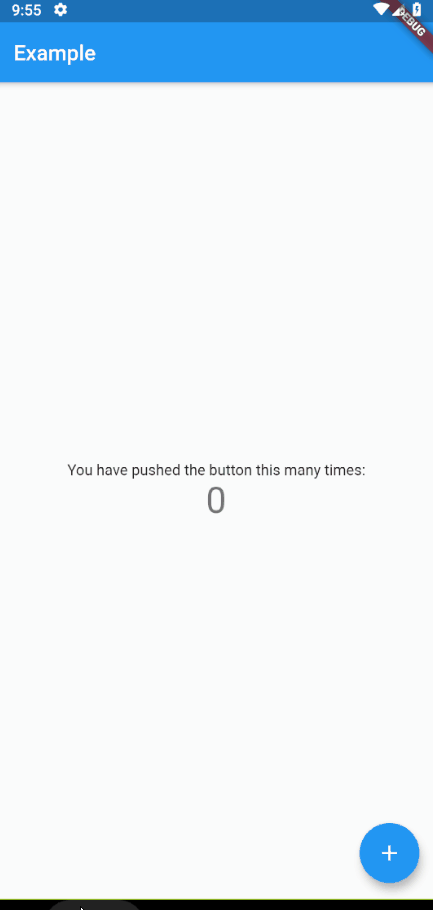

# double_back_to_close

Flutter package for request double back pressed before close app/route/screen.



## Usage

Wrapping widget with DoubleBack where you want to use double back to close screen or app:

### Default (using TOAST)
```dart
class MyApp extends StatelessWidget {
  @override
  Widget build(BuildContext context) {
    return MaterialApp(
      home: DoubleBack(
          message:"Press back again to close",
          child: Home(),
        ),
      ),
    );
  }
}
```


### Custom ( using flushbar for example)
```dart
import 'package:flushbar/flushbar.dart';


class MyApp extends StatelessWidget {
  @override
  Widget build(BuildContext context) {
    return MaterialApp(
      home: DoubleBack(
        onFirstBackPress: (context) {

          // you can use your custom here
          Flushbar(
            title: "Hey User",
            message: "Press back again to exit",
            duration: Duration(seconds: 2),
          )..show(context);

        },

        child: Home(),
      ),
    );
  }
}
```

### with custom delay
```dart
class MyApp extends StatelessWidget {
  @override
  Widget build(BuildContext context) {
    return MaterialApp(
      home: DoubleBack(
          onFirstBackPress: (context) {

            Flushbar(
              title: "Hey User",
              message: "Press back again to exit",
              duration: Duration(seconds: 15), // show 15 second flushbar
            )..show(context);

          },
          child: Home(),
          waitForSecondBackPress: 15, // wait for 15 second for second back pressed
        ),
    );
  }
}
```

### with custom condition
if you want to show message at spesific condition, for example, only show message if pageView at index 0.

```dart
class MyApp extends StatelessWidget {
  @override
  Widget build(BuildContext context) {
    return MaterialApp(
      home: DoubleBack(
          condition: tabIndex == 0, // only show message when tabIndex=0
          onConditionFail: (){
            setState((){
                tabIndex = 0; // if not 0, set pageview jumptopage 0
            });
          }
          child: Home(),
        ),
    );
  }
}
```
